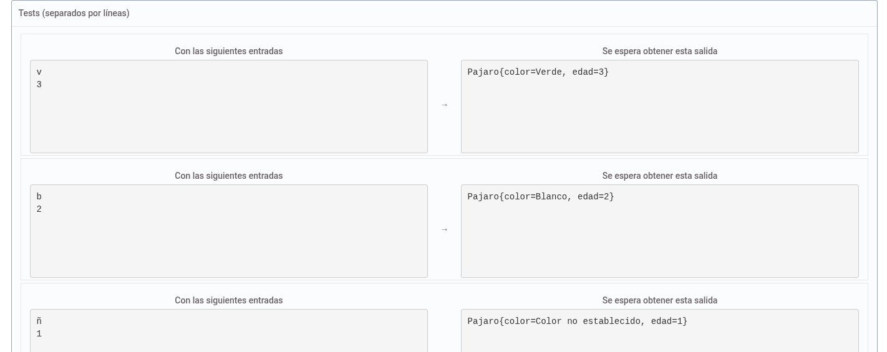

Crea la clase Pájaro con los atributos 

Color. (char) Inicial (v=verde, a=amarillo, g=gris, n=negro, b=blanco, y en cualquier otro caso "Color no establecido"
        
Edad
 

En la clase principal crea un objeto Pajaro, con los valores que se introducen por teclado y muestra su estado por pantalla

Salida con print

