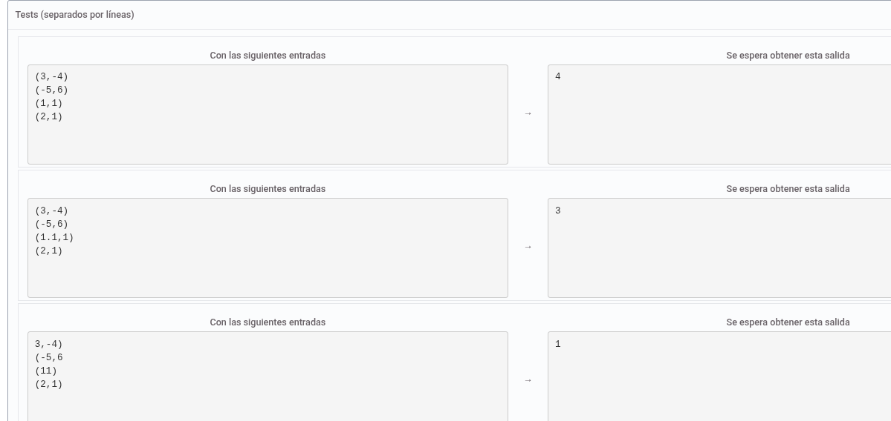

Realiza un programa en Java, que recibe 4 Strings, que representan a un Punto2D. El programa debe mostrar por pantalla, cuántos de ellos cumplen con la expresión regular "(x,y)". Los valores x e y son valores enteros, que pueden ser positivos o negativos.

